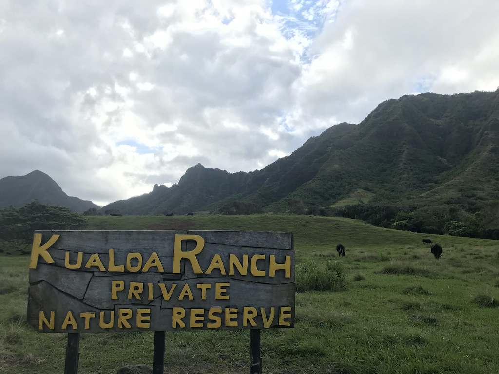
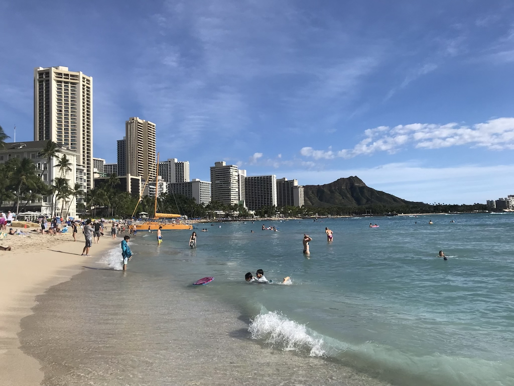
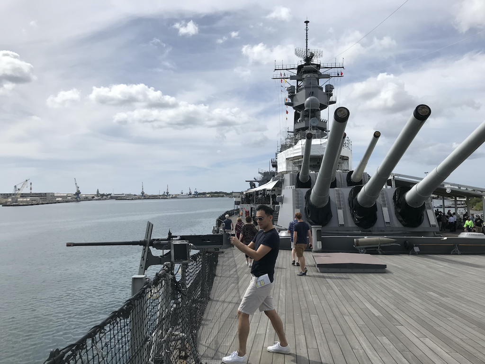
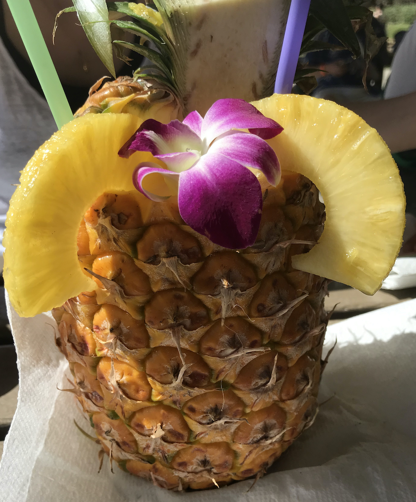

I went to a Hawaii for a holiday with my wife and her family. It was 6 days / 4 nights trip which is not enough for fully enjoying Hawaii and I'm still struggling with jet lag. I wrote title for this post as 'hang loose in the Aloha state', but actually I couldn't hang loose because of the tight schedule. However I just wanted to share my impression of Hawaii.

### Kualoa Ranch
Kualoa is a 4000-acre private nature reserve that has been the scene for a lot of Hollywood movies and tv shows. The most popular activities on Kualoa Ranch is an ATV tour. It was great way to see the beauty of the ranch and a quite exciting activity except that I had a shower with dust. Also we took a movie tour with very energetic and kind guide. Part of what's made Kualoa Ranch so famous are the movies that have filmed like Jurassic park, 50 First Dates, Pearl Harbor and Etc.

Normally I don't like visiting nature reserve things on my trip, but it has breathtaking views and some exciting activities. I think it's worth to try.

### Waikiki beach
Waikiki beach was the spot I exptected the most. Because it is one of the most famous beach in the world.

I expected beer or cocktail like Mojito laying down on the beach, but I couldn't find any beach bar and realized nobody was drinking any alcohol. I was wondering what was going on and finally ended up figuring out that driking in public is strictly prohibited In Hawaii, even on the beach.

Except the part that it's not allowed to drink(Maybe it's the most important reason 😅), it was really nice place to relax.

### Pearl harbor
My father in law wanted to visit Pearl harbor museum. Frankly speaking If I went to Hawaii with just my wife, we wouldn't visit Pearl harbor.(Might have just hanged in Waikiki beach 🏖️) Pearl harbor memorial was huge scale then I expected. It looked like it could take for whole day to see everything, so we decided to see battleship Missouri memorial.(Also it was quite expensive than I thought. To see everything, it costs 72$ for each person.)

We had a Korean narrated tour and I learned the battleship was related to Korean history too. I could remind what I learned from school but I forgot like World-War-2 and Korean War.

 

I should get back to work which is always unpleasnt after every holiday, especially this trip was too short and not my style because it was family trip(Everyone wants different things. 😭). But anyway it was quality time to refresh.

Lastly you should really try Hawaian pineapple slush and ice cream.🍍
